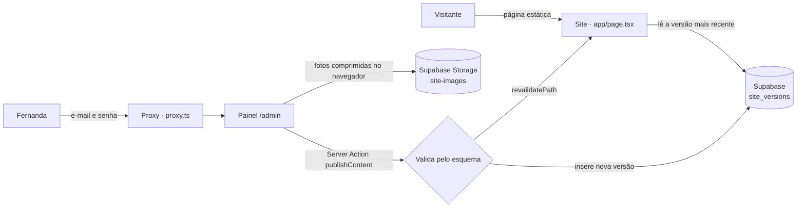

<div align="center">

# Maria Fernanda Campagnolo · Psicóloga

**Landing page com painel de edição próprio para uma psicóloga clínica e social.**<br>
Atendimento online, olhar especial para a terceira idade e palestras sobre saúde mental.

[](https://nextjs.org)
[](https://react.dev)
[](https://www.typescriptlang.org)
[](https://tailwindcss.com)
[](https://supabase.com)

[**fernandacampagnolo.com.br**](https://fernandacampagnolo.com.br)

<br>


</div>

<br>

## Sobre o projeto

Site institucional da psicóloga **Maria Fernanda Campagnolo** (CRP 06/213950), que atua na clínica online, com a terceira idade e no CRAS de Joanópolis (SP).

A ideia principal: **ela não sabe programar e precisa trocar textos e fotos sozinha**, sem WordPress nem plataformas prontas. Por isso o projeto tem um **painel de edição próprio** em `/admin`, feito sob medida: mostra só o que existe no site dela, com nomes simples ("Topo da página", "Sobre mim", "Palestras"), e funciona bem no celular.

O que é estrutural (layout, cores, novas seções) continua no código, e mudanças desse tipo chegam por chamado. O dia a dia (textos, fotos, temas, links) ela resolve sozinha.

## Funcionalidades

### Site
- **Landing page responsiva**, fiel ao design, do celular ao desktop.
- **WhatsApp em todo lugar**: botões de agendamento e de palestra abrem a conversa com mensagens prontas e diferentes, e há um botão flutuante fixo.
- **Seção de dúvidas frequentes** com acordeão acessível (`<details>`), sem JavaScript.
- **Fotos otimizadas** com `next/image` (WebP, tamanhos responsivos e carregamento sob demanda).
- **Página estática**: carrega rápido e só é regerada quando algo é publicado.

### Painel `/admin`
- **Login com e-mail e senha**; só os e-mails da tabela `admins` podem publicar.
- **Formulário gerado a partir de um esquema**, com rótulos amigáveis, textos de ajuda e **contador de caracteres**, para o layout nunca quebrar.
- **Troca de foto pela galeria do celular**, com **redimensionamento e compressão no próprio navegador** (no máximo 2000px, em WebP) antes do envio.
- **Listas editáveis**: adicionar, remover e reordenar temas de palestra, tópicos e perguntas.
- **Prévia** do site com as alterações antes de publicar.
- **Rascunho automático** no navegador: se a aba fechar, o painel oferece "Continuar de onde parei".
- **Histórico de versões**: cada publicação fica guardada e dá para voltar a qualquer versão com um clique.
- **Publicação instantânea**: o botão "Publicar" valida o conteúdo no servidor e regera a página na hora (`revalidatePath`).

### SEO
- Título e descrição pensados para buscas como *"psicóloga online"* e *"terapia para idosos"*.
- **Dados estruturados** (JSON-LD, schema.org): `Person`, `ProfessionalService`, `WebSite` e `FAQPage`.
- **Card de compartilhamento** gerado com `next/og`, com foto, nome, CRP e chamada para o WhatsApp.
- **Ícone "MF"** gerado em código (favicon, Apple Touch Icon).
- `sitemap.xml`, `robots.txt` (com o `/admin` bloqueado), endereço oficial (canonical) fixo e `noindex` no painel.

## Tecnologias

| Camada | Tecnologia | Para quê |
| --- | --- | --- |
| Framework | [Next.js 16](https://nextjs.org) (App Router, Turbopack) | Páginas estáticas, Server Actions, Proxy e geração de imagens |
| Interface | [React 19](https://react.dev) | `useActionState`, `useTransition`, Server e Client Components |
| Linguagem | [TypeScript 5](https://www.typescriptlang.org) | Tipagem de ponta a ponta do conteúdo editável |
| Estilo | [Tailwind CSS 4](https://tailwindcss.com) | Paleta própria via `@theme`, responsivo e mobile-first |
| Fontes | `next/font` · Cormorant Garamond + DM Sans | Fontes self-hosted, sem layout shift |
| Banco de dados | [Supabase Postgres](https://supabase.com/database) | Versões do conteúdo em `jsonb`, com Row Level Security |
| Autenticação | [Supabase Auth](https://supabase.com/auth) + `@supabase/ssr` | Sessão em cookies, renovada pelo `proxy.ts` |
| Arquivos | [Supabase Storage](https://supabase.com/storage) | Fotos enviadas pelo painel |
| Imagens | `next/image`, `next/og`, [sharp](https://sharp.pixelplumbing.com) | Otimização, card de compartilhamento e ícones |
| Qualidade | ESLint (`eslint-config-next`) | Regras de Core Web Vitals e React Hooks |

## Arquitetura



- **Conteúdo versionado**: cada "Publicar" grava uma linha nova em `site_versions`, e o site mostra sempre a mais recente. Desfazer é só publicar de novo uma versão antiga.
- **Um esquema, três usos**: [`lib/content/schema.ts`](lib/content/schema.ts) gera o formulário do painel, valida o conteúdo no servidor e define os limites de caracteres.
- **À prova de mudanças**: [`normalizeContent`](lib/content/validate.ts) encaixa versões antigas do banco no formato atual. Campos novos usam o conteúdo padrão e nada quebra.
- **Segurança em camadas**: o proxy só deixa entrar no `/admin` quem está logado; as Server Actions conferem a permissão; e o banco impõe as regras por RLS (`is_admin()`), inclusive no upload de fotos.
- **Funciona sem banco**: sem as variáveis do Supabase, o site continua no ar com o conteúdo padrão.

## Estrutura

```
app/
├── page.tsx                 # Landing page (estática + revalidação)
├── layout.tsx               # Fontes, metadata e SEO
├── opengraph-image.tsx      # Card de compartilhamento (next/og)
├── icon.tsx · apple-icon.tsx
├── sitemap.ts · robots.ts
└── admin/                   # Painel: editor, login, histórico, senha
    └── actions.ts           # Server Actions (publicar, restaurar, login…)
components/
├── site/                    # Seções da landing page, header, JSON-LD
└── admin/                   # Editor, campos, prévia, formulários
lib/
├── content/                 # Tipos, conteúdo padrão, esquema e validação
├── supabase/                # Clientes de servidor e de navegador
├── admin/upload-image.ts    # Compressão e upload de fotos
└── seo.ts · contact.ts
supabase/migrations/         # Tabelas, RLS e bucket de fotos
proxy.ts                     # Sessão e proteção do /admin
```

## Rodando localmente

**Requisitos:** Node.js 20.9+ e um projeto no [Supabase](https://supabase.com) (o plano gratuito atende).

```bash
git clone <url-do-repositorio>
cd fernandacampagnolopsicologa
npm install
cp .env.example .env.local   # preencha com os dados do Supabase
npm run dev
```

Acesse [localhost:3000](http://localhost:3000) para ver o site e [localhost:3000/admin](http://localhost:3000/admin) para o painel.

### Variáveis de ambiente

| Variável | Obrigatória | Descrição |
| --- | --- | --- |
| `NEXT_PUBLIC_SUPABASE_URL` | Sim | Project URL (Project Settings → Data API) |
| `NEXT_PUBLIC_SUPABASE_PUBLISHABLE_KEY` | Sim | Publishable key (Project Settings → API Keys) |
| `NEXT_PUBLIC_SITE_URL` | Não | Domínio oficial. Padrão: `https://fernandacampagnolo.com.br` |
| `NEXT_PUBLIC_GOOGLE_SITE_VERIFICATION` | Não | Código de verificação do Google Search Console |

### Configurando o Supabase

1. No **SQL Editor**, rode [`supabase/migrations/0001_site_content.sql`](supabase/migrations/0001_site_content.sql).
2. Libere quem pode editar:
   ```sql
   insert into public.admins (email) values ('email@exemplo.com');
   ```
3. Em **Authentication → Sign In / Providers**, desative *Allow new users to sign up*.
4. Em **Authentication → Users → Add user**, crie o login com o mesmo e-mail (marcando *Auto Confirm User*).

## Scripts

| Comando | Descrição |
| --- | --- |
| `npm run dev` | Servidor de desenvolvimento |
| `npm run build` | Build de produção |
| `npm start` | Servidor de produção |
| `npm run lint` | ESLint |
| `npm run typecheck` | Checagem de tipos do TypeScript |

## Commits e versões

O projeto segue o padrão [**Conventional Commits**](https://www.conventionalcommits.org/pt-br). A versão do `package.json` e o `CHANGELOG.md` são gerados automaticamente a partir das mensagens.

```bash
git commit -m "feat: adiciona seção de depoimentos"      # nova funcionalidade → versão minor (1.1.0)
git commit -m "fix(admin): corrige upload no iPhone"     # correção → versão patch (1.0.1)
git commit -m "docs: atualiza o README"                  # não gera versão
git commit -m "feat!: troca o login por link mágico"     # mudança que quebra → versão major (2.0.0)
```

| Tipo | Quando usar |
| --- | --- |
| `feat` | Funcionalidade nova |
| `fix` | Correção de bug |
| `perf` | Melhoria de desempenho |
| `refactor` | Mudança de código sem alterar comportamento |
| `docs` | Documentação |
| `style` | Formatação, sem mudar lógica |
| `chore` · `build` · `ci` · `test` | Manutenção, dependências, pipeline e testes |

**Automação:**
- **Husky + commitlint** recusam mensagens fora do padrão já no `git commit`.
- **lint-staged** roda o ESLint (com `--fix`) só nos arquivos alterados antes de cada commit.
- **CI** (GitHub Actions) roda lint, checagem de tipos e build em cada push e PR, e confere as mensagens dos commits nos PRs.
- **release-please** mantém aberto um PR *"chore(main): release X.Y.Z"* com a nova versão e o changelog. Ao dar merge nele, a tag e a release são criadas no GitHub.

## Licença

O **código** está sob a [licença MIT](LICENSE). As **fotos, textos e a identidade** de Maria Fernanda Campagnolo não fazem parte dessa licença e não podem ser reutilizados sem autorização dela.

<br>

<div align="center">

Desenvolvido por [**Felipe Nogueira**](https://nogueiradev.com.br)

</div>
